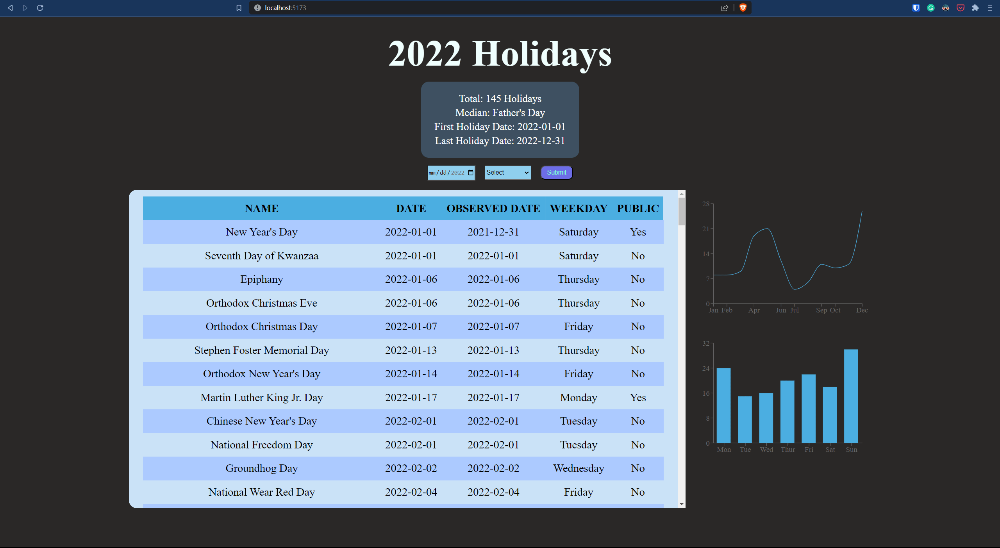

# Web Development Project 6 - *2022 Holiday Part 2*

Submitted by: **Shi Wei Zheng**

This web app: **This is the second part of the 2022 Holiday project where additional details of each holiday are added along with charts to show statistics.**

Time spent: **5** hours spent in total

## Required Features

The following **required** functionality is completed:

- [x] **The app includes at least two unique chart developed using the fetched data that tell an interesting story**
- [x] **Clicking on an item in the list view displays more details about it**
- [x] **Clicking on an item has a direct, unique link to that item's detail view page**

The following **optional** features are implemented:

- [ ] The site's customized dashboard contains more content that explains what is interesting about the data
- [ ] The site allows users to toggle between different data visualizations

The following **additional** features are implemented:

* [ ] List anything else that you added to improve the site's functionality!

## Video Walkthrough

Here's a walkthrough of implemented user stories:

<!-- Replace this with whatever GIF tool you used! -->
GIF created with ShareX 
<!-- Recommended tools:
[Kap](https://getkap.co/) for macOS
[ScreenToGif](https://www.screentogif.com/) for Windows
[peek](https://github.com/phw/peek) for Linux. -->

## Notes

Describe any challenges encountered while building the app.
- The challenge that I faced is when I tried to link to another route. I was not able to get the link to work since the data is in a table. Instead of using Link from react router dom, I use useNavigate to navigate to the route when the row is clicked.

## License

    Copyright [2023] [Shi Wei Zheng]

    Licensed under the Apache License, Version 2.0 (the "License");
    you may not use this file except in compliance with the License.
    You may obtain a copy of the License at

        http://www.apache.org/licenses/LICENSE-2.0

    Unless required by applicable law or agreed to in writing, software
    distributed under the License is distributed on an "AS IS" BASIS,
    WITHOUT WARRANTIES OR CONDITIONS OF ANY KIND, either express or implied.
    See the License for the specific language governing permissions and
    limitations under the License.